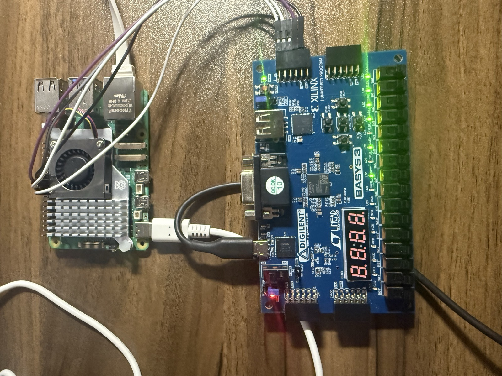
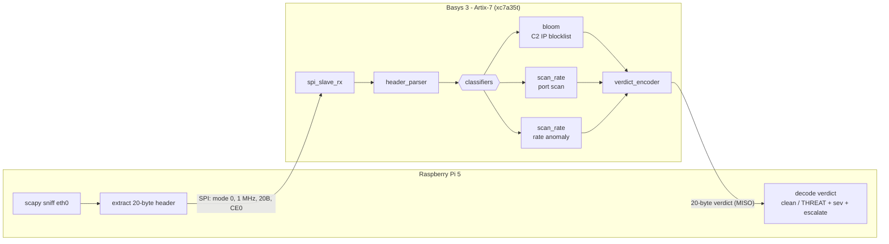

# fpga-pi-parallel-nids

A Raspberry Pi sniffs packets and offloads classification to a Basys 3 FPGA over SPI.
For each IPv4 packet, the Pi extracts a fixed 20-byte header and sends it to the FPGA.
The FPGA runs three classifier stages in parallel and returns a per-packet verdict.
The Pi decodes the verdict: clean, or flagged with the stages that fired, a severity,
and an escalate flag. It reports verdicts; it does not block traffic.

## Architecture

## What it detects
- **C2 blocklist (bloom):** source or destination IP on a known-bad list. Stateless —
  one Bloom-filter lookup.
- **Port scan:** one source probing many distinct destination ports (vertical) or many
  distinct hosts (horizontal), on TCP SYNs.
- **Rate anomaly:** one source sending an abnormal burst of packets (flood).

Port scan and rate anomaly are stateful: the FPGA keeps a small per-source table in BRAM
over a window of recent packets, the same logic mirrored bit-for-bit by a CPU reference.

Verified end to end on real hardware: a 120-frame round-trip (the bloom cases plus
scan, flood, window-boundary, and combined scenarios) matches the CPU reference 120/120.
The FPGA classifier core is a fixed 8 cycles — ~80 ns and jitter-free at 100 MHz; the same
logic on the Pi CPU runs ~3.4 us with large per-packet jitter.

## Live demo

`viz.py` shows the live classification stream — green clean, red threat — with a running summary. Run it on the Pi against the flashed board (`sudo python3 viz.py --iface eth0`), or anywhere with no hardware (`python3 viz.py --replay`).

### v2 closed-loop demo (capstone)

`run_demo.py` runs the full v2 observe→decide→act loop on the Pi 4B against the flashed FPGA — synthetic adversary scenarios (benign / C2 / port scan / flood), live snapshot polling, runtime rule pushes when a top talker emerges, and a curses dashboard. See [`docs/STEP5_DEMO.md`](docs/STEP5_DEMO.md) for the full walkthrough and silicon-verified logs in [`docs/demo_logs/`](docs/demo_logs/).

## Hardware
- Raspberry Pi 4B. Python, with scapy for capture and spidev for SPI.
- Basys 3 board, Xilinx Artix-7 (xc7a35t). Verilog, built with Vivado 2023.2.
- Link: SPI mode 0, 8 MHz, 32-byte frames (v2). v1 ran at 1 MHz / 20-byte. Four signal wires plus ground; the Pi is master.

## Implementation (Artix-7 xc7a35t, Vivado 2023.2)

Place-and-routed for the Basys 3 (`xc7a35tcpg236-1`) at 100 MHz. Full reports in [`docs/reports/`](docs/reports/).

| Resource | Used | Available | % |
|---|---:|---:|---:|
| Slice LUTs | 241 | 20,800 | 1.2% |
| Slice registers (FF) | 326 | 41,600 | 0.8% |
| Block RAM (RAMB36 / RAMB18) | 1 / 2 | 50 / 100 | — |
| DSP48E1 | 14 | 90 | 15.6% |

**Timing** (`sys_clk`, 10 ns / 100 MHz): WNS **+0.410 ns**, WHS **+0.072 ns**, **0 failing endpoints / 1101** — all timing constraints met (achieved Fmax ≈ 104 MHz). The DSPs are the multiply-shift hashes; the two block RAMs hold the Bloom bit-array and the per-source scan/rate table.

## FPGA modules (`fpga/src/`)
- `spi_slave_rx.v`: SPI slave. Samples MOSI and assembles each 20-byte frame.
- `header_parser.v`: splits the 20-byte frame into header fields.
- `bloom_filter.v`: Bloom membership test. Two multiply-shift hashes over dual-port BRAM.
- `bloom_init.mem`: the Bloom bit-array, generated from the blocklist.
- `scan_rate.v`: stateful port-scan + rate-anomaly stage. Per-source state table in BRAM,
  16-frame windows, fingerprint bitmaps + popcount for distinct port/host counting.
- `classifiers.v`: runs the bloom and scan_rate stages in parallel and combines them into
  one verdict (mask, max severity, escalate).
- `verdict_encoder.v`: packs the result into the 20-byte verdict frame.
- `nids_top.v`: top level. Wires receiver, parser, classifiers, and encoder to MISO.

## Pi modules
- `packet_capture.py`: sniff packets, extract the header, send over SPI, print the verdict.
- `spi_link.py`: SPI master wrapper over spidev.
- `verdict.py`: encode and decode verdict frames.
- `bloom.py`: build the Bloom bit-array from a blocklist. Writes `bloom_init.mem`.
- `scan_rate.py`: CPU model of the per-source state table — bit-exact to `scan_rate.v`.
- `classifier.py`: the CPU reference classifier (bloom + scan_rate). Reference and benchmark.
- `scenarios.py`, `gen_verdict_golden.py`: the golden verdict stream the tests and the
  silicon round-trip replay.
- `benchmark.py`: compares per-packet latency of the FPGA core against the Pi CPU.
- `spi_verdict_check.py`, `silicon_check.py`: clock the golden stream over the link and check the verdicts.
- `spi_loopback_test.py`, `spi_fpga_bringup.py`: SPI bring-up self-tests.
